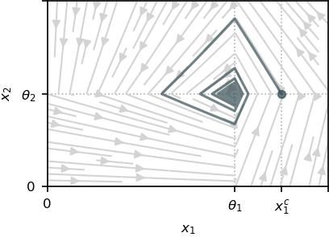

# Damped genetic oscillator

The simplest GRN exhibiting oscillatory behaviors can be modeled through two variables $x_1$ and $x_2$ with opposite mutual effects: $x_1$ catalyzes the production of $x_2$, that in turn inhibits the production of $x_1$. We suppose that the system can be externally controlled by a chemical inducer that targets only one of the genes. The model is defined as
```math
\left\{ \begin{array}{l}
\dot{x}_1 = -\gamma_1 x_1 + u(t) k_1 s^{-}(x_2,\theta_2) , \\
\dot{x}_2 = -\gamma_2 x_2 + k_2  s^{+}(x_1,\theta_1).
\end{array}\right.
```
where a detail of each term can be found in [Introduction](index.md#context).

For any initial condition, the openloop system (i.e, $u \equiv 1$) converges to the equilibrium point $(\theta_1, \theta_2)$ when $t \rightarrow \infty$, producing a damped oscillatory behavior[^1]:



The control objective is to induce a sustained oscillation. Thus, we can state the problem of producing a single cycle, which can be written through the initial and terminal constraints:
```math
    x(0) = x(t_f) = (x_1^c, \theta_2 ) 
```
for free final time $t_f > 0$ and for $x_1^c > \theta_1$.

## Problem definition

```@example main
using Plots
using Plots.PlotMeasures
using OptimalControl
using NLPModelsIpopt
nothing # hide
```

We define the regularization functions, where the method is decided through the argument `regMethod`.

```@example main
# Regularization of the PWL dynamics
function s⁺(x, θ, regMethod)
    if regMethod == 1 # Hill
        out = x^k/(x^k + θ^k)
    elseif regMethod == 2 # Exponential
        out = 1 - 1/(1 + exp(k*(x-θ)))
    end
    return out
end

# Regularization of |u(t) - 1|
function abs_m1(u, regMethod)
    if regMethod == 1 # Hill
        out = (u^k - 1)/(u^k + 1)
    elseif regMethod == 2 # Exponential
        out = 1 - 2/(1 + exp(k*(u-1)))
    end
    return out*(u - 1)
end
nothing # hide
```

Definition of the OCP:

```@example main
# Constant definition
k₁    = 2;    k₂    = 3     # Production rates
γ₁    = 0.2;  γ₂    = 0.3   # Degradation rates
θ₁    = 4;    θ₂    = 3     # Transcriptional thresholds
uₘᵢₙ  = 0.6;  uₘₐₓ  = 1.4   # Control bounds
x₁ᶜ   = 4.7                 # Cycle point (initial and final)
λ     = 0.5                 # Trade-off fuel/time

# Initial guest for the NLP
tf    = 1
u(t)  = 2
sol = (control=u, variable=tf)

# Optimal control problem definition
ocp = @def begin

    tf ∈ R,                variable
    t ∈ [ 0, tf ],         time
    x = [ x₁, x₂ ] ∈ R²,   state
    u ∈ R,                 control 

    x₁(0) == x₁ᶜ
    x₂(0) == θ₂
    x₁(tf) == x₁ᶜ
    x₂(tf) == θ₂

    uₘᵢₙ ≤ u(t) ≤ uₘₐₓ
    tf ≥ 1 # Force the state out of the confort zone

    ẋ(t) == [ - γ₁*x₁(t) + k₁*u(t)*s⁺(x₂(t),θ₂,regMethod)  ,
              - γ₂*x₂(t) + k₂*(1 - s⁺(x₁(t),θ₁,regMethod)) ]

    ∫(λ*abs_m1(u(t),regMethod) + 1-λ) → min      

end
nothing # hide
```

## Resolution through Hill regularization

In order to ensure convergence of the solver, we solve the OCP by iteratively increasing the parameter $k$ while using the $i-1$-th solution as the initialization of the $i$-th iteration.

```@example main
regMethod = 1       # Hill regularization
ki = 10             # Value of k for the first iteration
N = 400
maxki = 30          # Value of k for the last iteration
while ki < maxki
    global ki += 10  # Iteration step
    local print_level = (ki == maxki) # Only print the output on the last iteration
    global k = ki
    global sol = solve(ocp; grid_size=N, init=sol, print_level=4*print_level)
end
nothing # hide
```

Plotting of the results:

```@example main
plt1 = plot()
plt2 = plot()

tf    = sol.variable
tspan = range(0, tf, N)   # time interval
x₁(t) = sol.state(t)[1]
x₂(t) = sol.state(t)[2]
u(t)  = sol.control(t)

xticks = ([0, θ₁, x₁ᶜ], ["0", "θ₁", "x₁ᶜ"])
yticks = ([0, θ₂], ["0", "θ₂"])

plot!(plt1, x₁.(tspan), x₂.(tspan), label="optimal trajectory", xlabel="x₁", ylabel="x₂", xlimits=(θ₁/1.25, 1.1*x₁ᶜ), ylimits=(θ₂/2, 1.5*θ₂))
xticks!(xticks)
yticks!(yticks)
plot!(plt2, tspan, u, label="optimal control", xlabel="t")
plot(plt1, plt2; layout=(1,2), size=(800,300))
```

## Resolution through exponential regularization

The same procedure for iteratively increasing $k$ is used.

```@example main
regMethod = 2       # Exponential regularization
ki = 20             # Value of k for the first iteration
N = 400
maxki = 400          # Value of k for the last iteration
while ki < maxki
    global ki += 20  # Iteration step
    local print_level = (ki == maxki) # Only print the output on the last iteration
    global k = ki
    global sol = solve(ocp; grid_size=N, init=sol, print_level=4*print_level)
end
nothing # hide
```

Plotting of the results:

```@example main
plt1 = plot()
plt2 = plot()

tf    = sol.variable
tspan = range(0, tf, N)   # time interval
x₁(t) = sol.state(t)[1]
x₂(t) = sol.state(t)[2]
u(t)  = sol.control(t)

xticks = ([0, θ₁, x₁ᶜ], ["0", "θ₁", "x₁ᶜ"])
yticks = ([0, θ₂], ["0", "θ₂"])

plot!(plt1, x₁.(tspan), x₂.(tspan), label="optimal trajectory", xlabel="x₁", ylabel="x₂", xlimits=(θ₁/1.25, 1.1*x₁ᶜ), ylimits=(θ₂/2, 1.5*θ₂))
xticks!(xticks)
yticks!(yticks)
plot!(plt2, tspan, u, label="optimal control", xlabel="t")
plot(plt1, plt2; layout=(1,2), size=(800,300))
```

[^1]: E. Farcot, J.-L. Gouzé, Periodic solutions of piecewise affine gene network models with non uniform decay rates: the case of a negative feedback loop, Acta biotheoretica 57 (4) (2009) 429–455.